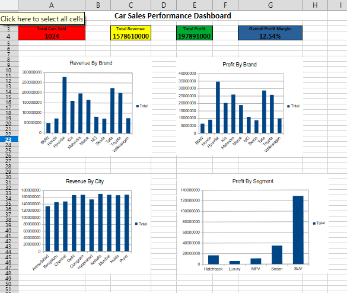
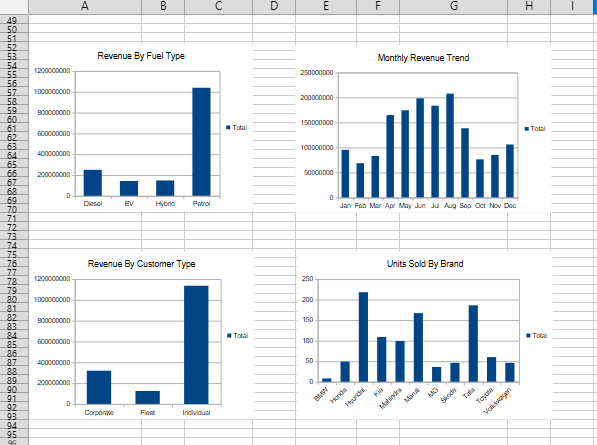

# Car Sales Performance Analysis

## Project Overview

This project analyzes car sales data to identify revenue trends, profitability patterns, sales performance, and customer behavior.

The analysis was created using LibreOffice Calc and includes data cleaning, KPI calculations, pivot tables, charts, an interactive-style dashboard, and key business insights.

## Tools Used

- LibreOffice Calc
- Pivot Tables
- Spreadsheet Formulas
- Data Visualization
- Dashboard Design

## Key Analysis

The project analyzes:

- Revenue by Brand
- Profit by Brand
- Units Sold by Brand
- Revenue by City
- Profit by Vehicle Segment
- Revenue by Fuel Type
- Monthly Revenue Trends
- Revenue by Customer Type

## Key Business Insights

- Hyundai generated the highest revenue among the analyzed brands.
- Hyundai also recorded the highest total profit and unit sales.
- SUVs accounted for the largest share of total profit.
- Petrol vehicles generated the majority of total revenue.
- Individual customers contributed the largest share of revenue.
- Revenue showed strong performance during the middle of the year, with August recording the highest monthly revenue.

## Project Structure

The main analysis workbook contains:

1. Raw Data
2. Data Cleaning
3. Calculations & KPIs
4. Pivot Table Analysis
5. Dashboard
6. Key Business Insights

## Project File

The complete Excel workbook is available in this repository:

**Car Sales Performance Analysis.xlsx**

## Dashboard Preview

